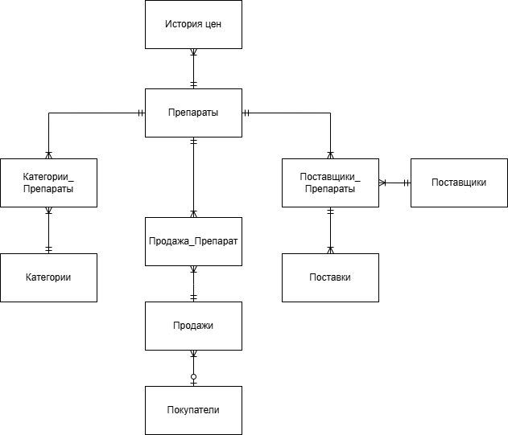
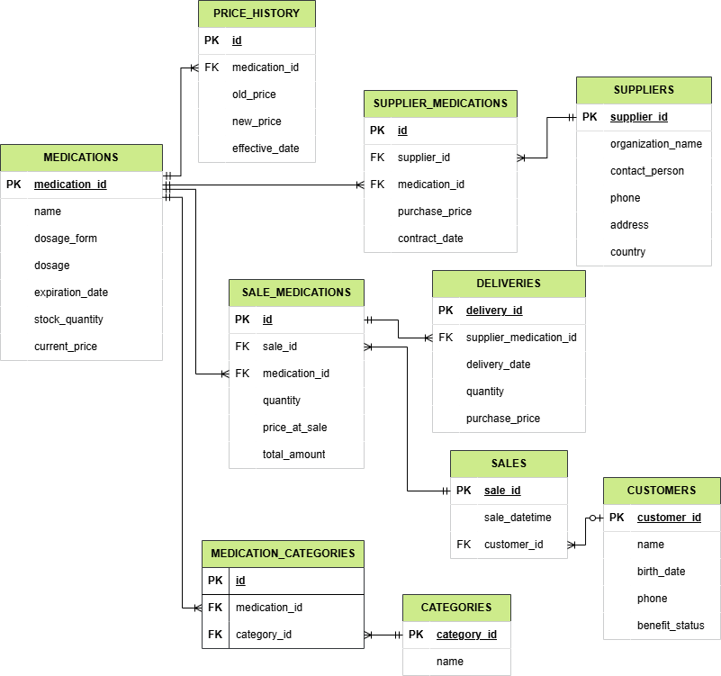
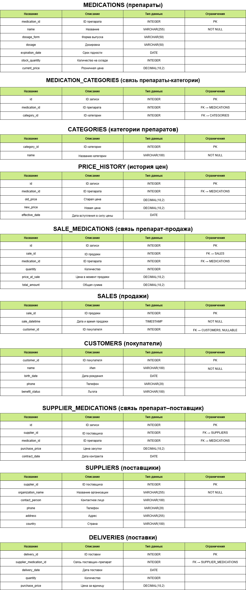

# Аптечная база данных

## Общее описание

Данная база данных предназначена для управления аптечным товарооборотом: учёта лекарственных препаратов, поставщиков, покупателей и операций продажи/поставки.

В составе базы представлены следующие основные таблицы:

- **MEDICATIONS** — информация о препаратах: наименование, форма, дозировка, срок годности, цена и количество на складе.
- **CATEGORIES** — справочник категорий, к которым может относиться препарат.
- **MEDICATION_CATEGORIES** — таблица связи между препаратами и категориями (многие ко многим).
- **PRICE_HISTORY** — история изменения цен на препараты.
- **SUPPLIERS** — данные о поставщиках.
- **SUPPLIER_MEDICATIONS** — связь между препаратами и поставщиками с контрактной информацией и закупочной ценой.
- **DELIVERIES** — информация о поставках от поставщиков.
- **CUSTOMERS** — сведения о покупателях.
- **SALES** — операции продаж.
- **SALE_MEDICATIONS** — конкретные препараты в составе каждой продажи.

## Нормальная форма логической модели

Используется **третья нормальная форма (3NF)**.

**Обоснование:**

- Все атрибуты в таблицах атомарны (**1NF** соблюдена).
- Все неключевые поля зависят от первичных ключей и не содержат частичных зависимостей (**2NF** соблюдена).
- Нет транзитивных зависимостей — каждое неключевое поле зависит только от ключа (**3NF** соблюдена).
- Все связи между сущностями вынесены в отдельные таблицы (*SALE_MEDICATIONS*, *SUPPLIER_MEDICATIONS*, *MEDICATION_CATEGORIES*), что исключает дублирование.

## Версионирование данных

Используется табличное версионирование на примере таблицы **PRICE_HISTORY**.

**Обоснование:**

- Позволяет хранить всю историю изменений цены для каждого препарата.
- Указана дата вступления цены в силу (`effective_date`), что позволяет:
  - делать временной анализ
  - восстанавливать данные "на момент продажи"
  - отслеживать динамику цен
- Такой подход проще в реализации и хорошо масштабируется, особенно для отчётности и аналитики.

## Модели базы данных

### Концептуальная модель



### Логическая модель



### Физическая модель




# SQL-запросы к базе данных аптеки

Примеры продвинутых SQL-запросов к базе данных аптеки с использованием:
- `WHERE`, `GROUP BY`, `HAVING`, `ORDER BY`
- `JOIN` (LEFT, INNER, самосоединение)
- Подзапросов (`IN`, `ALL`, `EXISTS`)
- Оконных функций (`RANK()`, `LAG()`)
- `LIMIT`, `OFFSET`

---

### 1. Медикаменты с ценой выше средней

```sql
SELECT name, current_price
FROM medications
WHERE current_price > (
    SELECT AVG(current_price) FROM medications
)
ORDER BY current_price DESC;
```

### 2. Количество медикаментов в каждой категории

```sql
SELECT c.name AS category_name, COUNT(mc.medication_id) AS medication_count
FROM categories c
LEFT JOIN medication_categories mc ON c.category_id = mc.category_id
GROUP BY c.name
ORDER BY medication_count DESC;
```
Группировка по категориям, с подсчётом медикаментов.

### 3. Поставщики дорогих медикаментов
```sql
SELECT DISTINCT s.organization_name
FROM suppliers s
JOIN supplier_medications sm ON s.supplier_id = sm.supplier_id
JOIN medications m ON sm.medication_id = m.medication_id
WHERE m.current_price > 200;
```
Ищет поставщиков, у которых есть медикаменты дороже 200.

### 4. Медикаменты из категорий "Антибиотики" или "Противовирусные"

```sql
SELECT m.name
FROM medications m
JOIN medication_categories mc ON m.medication_id = mc.medication_id
JOIN categories c ON mc.category_id = c.category_id
WHERE c.name IN ('Antibiotiki', 'Protivovirusnye');
```
Фильтрация по категориям.

### 5. Рейтинг медикаментов по цене

```sql
SELECT name, current_price,
       RANK() OVER (ORDER BY current_price DESC) AS price_rank
FROM medications;
```
Оконная функция RANK() — ранжирование по цене.

### 6. Медикаменты дороже всех, поставляемых из России

```sql
SELECT name, current_price
FROM medications
WHERE current_price > ALL (
    SELECT m.current_price
    FROM medications m
    JOIN supplier_medications sm ON m.medication_id = sm.medication_id
    JOIN suppliers s ON s.supplier_id = sm.supplier_id
    WHERE s.country = 'Russia'
);
```
Использует подзапрос с ALL.

### 7. Текущая и предыдущая цена медикаментов

```sql
SELECT name, current_price,
       LAG(current_price) OVER (ORDER BY current_price) AS previous_price
FROM medications;
```
Оконная функция LAG() показывает предыдущую цену.

### 8. Средняя цена в категории (если > 2 медикаментов)

```sql
SELECT c.name AS category_name, AVG(m.current_price) AS avg_price
FROM categories c
JOIN medication_categories mc ON c.category_id = mc.category_id
JOIN medications m ON mc.medication_id = m.medication_id
GROUP BY c.name
HAVING COUNT(m.medication_id) > 2
ORDER BY avg_price DESC;
```
Фильтрация с HAVING по количеству медикаментов.

### 9. Пары медикаментов с одинаковой дозировкой

```sql
SELECT m1.name AS medication1, m2.name AS medication2, m1.dosage
FROM medications m1
JOIN medications m2 ON m1.dosage = m2.dosage AND m1.medication_id < m2.medication_id;
```
Самосоединение: находит пары с одинаковой дозой.

### 10. Постраничный вывод медикаментов (2-я страница, по 5 записей)

```sql
SELECT *
FROM medications
ORDER BY name
LIMIT 5 OFFSET 5;
```
Пагинация: 2-я страница по 5 записей.
